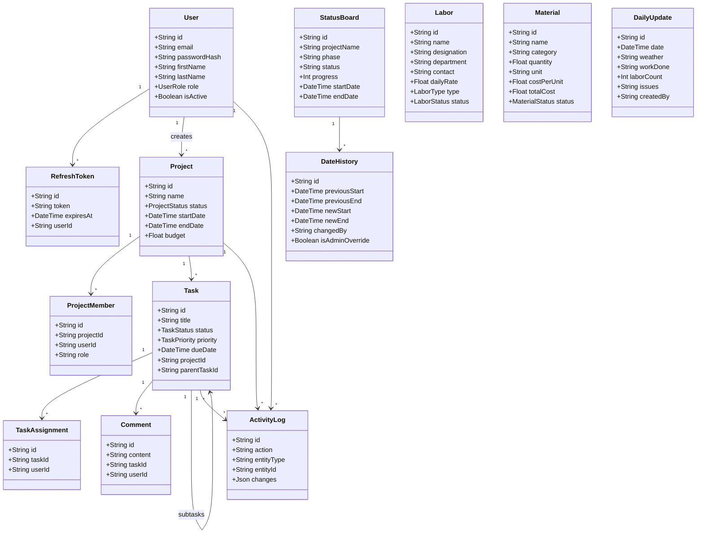
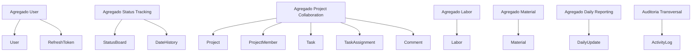
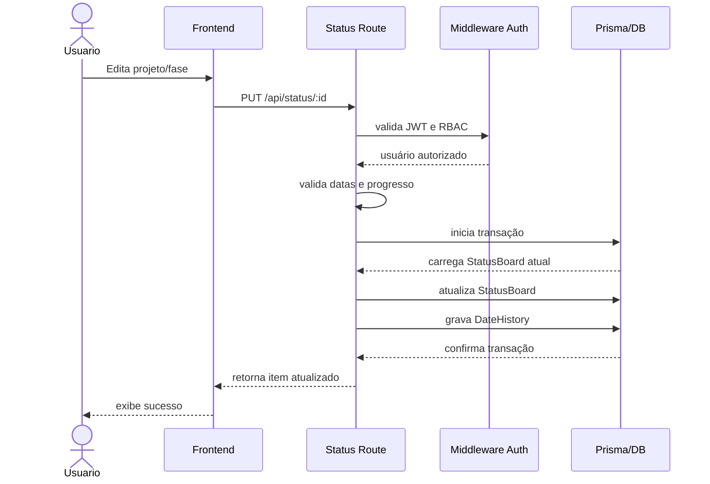
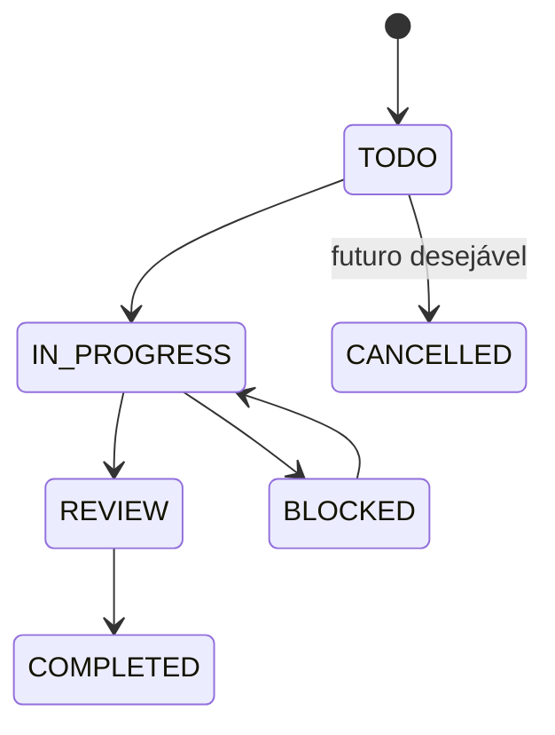

# Análise de Arquitetura de Soluções

## 1. Visão Executiva

O projeto `Contra` é um monólito web com frontend em SvelteKit, backend Node.js/Express e persistência em PostgreSQL via Prisma. O domínio atual é centrado em gestão operacional de obras, com foco em:

- acompanhamento de status por projeto/fase;
- controle de mão de obra;
- controle de materiais;
- atualizações diárias de obra;
- autenticação com JWT e RBAC por perfil.

Há, porém, um segundo domínio mais amplo já modelado no banco, mas ainda parcialmente não implementado na aplicação: colaboração de projetos e tarefas (`Project`, `Task`, `Comment`, `ActivityLog`, `ProjectMember`, `TaskAssignment`). Isso caracteriza um sistema em transição entre:

1. um produto operacional de obra já utilizável; e
2. uma plataforma mais completa de colaboração e governança ainda incompleta.

## 2. Arquitetura Atual

### 2.1 Estilo arquitetural

- Monólito modular.
- Frontend SPA/SSR leve em SvelteKit.
- Backend REST em Express.
- Persistência relacional com Prisma.
- Autenticação stateless com access token JWT e refresh token persistido em banco.
- Observabilidade inicial com Sentry.

### 2.2 Camadas identificadas

| Camada | Responsabilidade | Evidências |
|---|---|---|
| Apresentação | Telas, navegação, formulários, filtros e RBAC visual | `src/routes`, `src/lib/components` |
| Integração cliente | Chamada HTTP e refresh automático de sessão | `src/lib/api.ts`, `src/lib/stores/auth.svelte.ts` |
| API | Exposição REST e orquestração de regras | `server/routes/*.js` |
| Segurança | Autenticação e autorização por perfil | `server/middleware/auth.middleware.js`, `server/utils/auth.js` |
| Persistência | Mapeamento ORM e transações | `prisma/schema.prisma`, `server/database/*.js` |
| Observabilidade | Telemetria de erros | `server/index.js` |

### 2.3 Integrações

- Frontend -> Backend via HTTP/JSON.
- Backend -> PostgreSQL via Prisma.
- Backend -> Sentry para erros e tracing.
- Deploy auxiliar previsto para Netlify/serverless, mas sem clareza de aderência completa ao backend Express atual.

## 3. Conceitos Principais do Domínio

### 3.1 Entidades implementadas ou claramente operacionais

| Entidade | Papel no domínio |
|---|---|
| `User` | Representa usuário autenticável e perfil de acesso. |
| `RefreshToken` | Mantém continuidade de sessão. |
| `StatusBoard` | Representa o acompanhamento de um projeto em uma fase específica. |
| `DateHistory` | Registra histórico de alterações de prazo do `StatusBoard`. |
| `Labor` | Representa recurso humano da obra. |
| `Material` | Representa insumo físico controlado no projeto. |
| `DailyUpdate` | Representa boletim diário de operação. |

### 3.2 Entidades modeladas, mas ainda não expostas de forma consistente

| Entidade | Papel pretendido |
|---|---|
| `Project` | Projeto macro com ciclo de vida, orçamento e cliente. |
| `ProjectMember` | Associação entre usuário e projeto. |
| `Task` | Trabalho planejado dentro de um projeto, inclusive subtarefas. |
| `TaskAssignment` | Atribuição de usuários a tarefas. |
| `Comment` | Comunicação vinculada à tarefa. |
| `ActivityLog` | Auditoria transversal de ações. |

## 4. Agregados, Objetos Valor, Serviços e Eventos

### 4.1 Agregados

| Agregado | Raiz | Componentes | Observação |
|---|---|---|---|
| Identidade e Acesso | `User` | `RefreshToken` | Implementado. |
| Acompanhamento de Prazo | `StatusBoard` | `DateHistory` | Implementado com transação. |
| Recursos Humanos | `Labor` | - | Implementado, mas sem validação robusta no backend. |
| Materiais | `Material` | - | Implementado parcialmente; UI ainda incompleta. |
| Diário de Obra | `DailyUpdate` | - | API existe, tela ainda stub. |
| Colaboração de Projeto | `Project` | `ProjectMember`, `Task`, `TaskAssignment`, `Comment` | Modelado, mas incompleto na aplicação. |
| Auditoria | `ActivityLog` | - | Modelado, mas sem uso efetivo nas rotas. |

### 4.2 Objetos valor inferidos

Embora não existam tipos explícitos de Value Object no código, o domínio pede estes conceitos:

| Objeto valor | Composição | Uso esperado |
|---|---|---|
| Período Planejado | `startDate`, `endDate` | Prazo de projeto/fase/tarefa. |
| Percentual de Progresso | `progress` | Faixa válida 0..100. |
| Valor Monetário | `budget`, `dailyRate`, `costPerUnit`, `totalCost` | Custos e orçamento. |
| Identidade de Sessão | `accessToken`, `refreshToken` | Continuidade de autenticação. |
| Dados de Contato | `email`, `phoneNumber`, `contact` | Contato de usuário, cliente e mão de obra. |
| Intervalo de Consulta | `startDate`, `endDate` em filtros | Pesquisa de dashboard e diário. |
| Metadado de Auditoria | `changedBy`, `ipAddress`, `userAgent`, `overrideReason` | Rastreabilidade. |

### 4.3 Serviços de domínio/aplicação

| Serviço | Responsabilidade |
|---|---|
| Serviço de autenticação | Login, hash, emissão e validação de JWT, refresh e logout. |
| Serviço de autorização | Aplicação de RBAC por rota e método HTTP. |
| Serviço de acompanhamento de prazo | Upsert de fase/projeto com histórico de datas. |
| Serviço de consulta operacional | Filtros por período, tipo e categoria. |
| Serviço de estatística diária | Soma de manpower, média e contagem de incidentes de segurança. |

### 4.4 Eventos de domínio identificados

| Evento | Situação |
|---|---|
| `UserLoggedIn` | Implementado implicitamente no login. |
| `RefreshTokenIssued` | Implementado implicitamente. |
| `RefreshTokenRevoked` | Implementado implicitamente no logout. |
| `StatusBoardUpserted` | Implementado implicitamente. |
| `DateOverrideRegistered` | Implementado via `DateHistory`. |
| `LaborRegistered` | Implícito no CRUD. |
| `MaterialUpdated` | Implícito no CRUD. |
| `DailyUpdateReported` | Implícito no CRUD. |
| `TaskAssigned` | Apenas modelado. |
| `CommentAdded` | Apenas modelado. |
| `ActivityLogged` | Apenas modelado. |

## 5. Relacionamentos do Domínio

### 5.1 Relacionamentos fortes

- Um `User` cria muitos `Project`.
- Um `Project` possui muitos `ProjectMember`.
- Um `Project` possui muitas `Task`.
- Uma `Task` pode possuir subtarefas.
- Uma `Task` pode ter muitos responsáveis por `TaskAssignment`.
- Uma `Task` pode ter muitos `Comment`.
- Um `StatusBoard` possui muitos `DateHistory`.
- Um `User` possui muitos `RefreshToken`.

### 5.2 Relações implícitas, mas não bem materializadas na operação

- `DailyUpdate` deveria referenciar de forma forte um `User` e possivelmente um `Project`, mas guarda `createdBy` como string.
- `Labor`, `Material` e `StatusBoard` deveriam ter vínculo explícito com `Project`, mas hoje aparecem como cadastros soltos ou ligados apenas por nome/fase.
- `ActivityLog` deveria registrar ações de CRUD em todas as entidades críticas, mas ainda não foi integrado ao fluxo.

## 6. Descrição Detalhada das Entidades e Atributos

### 6.1 Identidade e acesso

| Entidade | Atributos principais |
|---|---|
| `User` | `id`, `email`, `passwordHash`, `firstName`, `lastName`, `role`, `isActive`, `phoneNumber`, `avatarUrl`, `lastLoginAt`, `createdAt`, `updatedAt` |
| `RefreshToken` | `id`, `token`, `userId`, `expiresAt`, `createdAt` |

### 6.2 Planejamento e colaboração

| Entidade | Atributos principais |
|---|---|
| `Project` | `id`, `name`, `description`, `status`, `startDate`, `endDate`, `budget`, `location`, `clientName`, `clientContact`, `createdById`, `createdAt`, `updatedAt` |
| `ProjectMember` | `id`, `projectId`, `userId`, `role`, `joinedAt` |
| `Task` | `id`, `title`, `description`, `status`, `priority`, `dueDate`, `estimatedHours`, `actualHours`, `projectId`, `createdById`, `parentTaskId`, `completedAt`, `createdAt`, `updatedAt` |
| `TaskAssignment` | `id`, `taskId`, `userId`, `assignedAt` |
| `Comment` | `id`, `content`, `taskId`, `userId`, `createdAt`, `updatedAt` |
| `ActivityLog` | `id`, `action`, `entityType`, `entityId`, `changes`, `ipAddress`, `userAgent`, `userId`, `projectId`, `taskId`, `createdAt` |

### 6.3 Operação de obra

| Entidade | Atributos principais |
|---|---|
| `StatusBoard` | `id`, `projectName`, `phase`, `status`, `progress`, `startDate`, `endDate`, `createdAt`, `updatedAt` |
| `DateHistory` | `id`, `statusBoardId`, `previousStart`, `previousEnd`, `newStart`, `newEnd`, `changedAt`, `changedBy`, `isAdminOverride`, `overrideReason` |
| `Labor` | `id`, `name`, `designation`, `department`, `contact`, `dailyRate`, `type`, `status`, `createdAt`, `updatedAt` |
| `Material` | `id`, `name`, `category`, `quantity`, `unit`, `supplier`, `costPerUnit`, `totalCost`, `deliveryDate`, `status`, `createdAt`, `updatedAt` |
| `DailyUpdate` | `id`, `date`, `weather`, `workDone`, `laborCount`, `issues`, `photos`, `createdBy`, `createdAt`, `updatedAt` |

## 7. Regras de Negócio Explícitas e Implícitas

### 7.1 Regras explícitas no código

| Regra | Tipo |
|---|---|
| Login exige `email` e `password`. | Explícita |
| Usuário inativo não autentica. | Explícita |
| Refresh token deve existir, não estar expirado e pertencer a usuário ativo. | Explícita |
| Rotas de `status`, `labor`, `materials` e `daily-updates` exigem autenticação. | Explícita |
| Permissões mudam por módulo e método HTTP. | Explícita |
| `StatusBoard` exige `projectName`, `phase`, `startDate`, `endDate`. | Explícita |
| `progress` do `StatusBoard` deve estar entre 0 e 100. | Explícita |
| `endDate` deve ser maior que `startDate`. | Explícita |
| Cada combinação `projectName + phase` em `StatusBoard` é única. | Explícita |
| Alteração de datas em `StatusBoard` gera `DateHistory`. | Explícita |
| `ProjectMember` é único por `projectId + userId`. | Explícita |
| `TaskAssignment` é único por `taskId + userId`. | Explícita |
| `Material.totalCost` é derivado de `quantity * costPerUnit` na criação. | Explícita |
| Estatística de segurança no diário usa texto contendo `safety`. | Explícita |

### 7.2 Regras implícitas do domínio

| Regra | Justificativa |
|---|---|
| Todo dado operacional deveria pertencer a um projeto formal. | Necessário para rastreabilidade e relatórios. |
| Fases de obra deveriam ser catálogo controlado, não texto livre. | Evita divergência semântica. |
| Status deveriam ser enum padronizado ponta a ponta. | Hoje há mistura de `PLANNING`, `IN_PROGRESS`, `Em Progresso`, etc. |
| Alterações críticas deveriam gerar auditoria. | Há modelo `ActivityLog`, mas sem uso efetivo. |
| Dados monetários deveriam adotar precisão decimal controlada. | Uso atual de `Float` pode gerar erro de arredondamento. |
| `DailyUpdate` deveria referenciar autor e projeto por FK. | Hoje usa string simples em `createdBy`. |
| Relatórios dependem de normalização entre `StatusBoard`, `Labor`, `Material` e `DailyUpdate`. | Sem vínculo forte, relatórios ficam frágeis. |
| Tokens sensíveis não deveriam ficar em `localStorage`. | Risco de exposição por XSS. |

## 8. UML em Markdown

### 8.1 Diagrama de classes

### 8.2 Diagrama de agregados

### 8.3 Diagrama de sequência: atualização de status com histórico

### 8.4 Diagrama de estados: status de tarefa projetado

## 9. Casos de Uso Principais

| Caso de uso | Atores | Resultado esperado |
|---|---|---|
| UC01 - Autenticar usuário | Todos os perfis | Sessão válida com access token e refresh token |
| UC02 - Consultar dashboard | Todos os usuários autenticados | Visão consolidada de status e estatísticas |
| UC03 - Criar/editar item de status | `ADMIN`, `MANAGER` | Projeto/fase atualizado com histórico |
| UC04 - Gerir mão de obra | `ADMIN`, `MANAGER` | Cadastro, edição, exclusão e filtro de trabalhadores |
| UC05 - Consultar/gerir materiais | `ADMIN`, `MANAGER`, `SUPERVISOR` | Controle de insumos e custos |
| UC06 - Registrar atualização diária | `ADMIN`, `MANAGER`, `SUPERVISOR`, `WORKER` | Diário com produção, issues e fotos |
| UC07 - Renovar sessão | Todos os perfis | Continuidade de uso sem novo login |
| UC08 - Gerir projetos, tarefas e comentários | Planejado | Coordenação colaborativa ponta a ponta |
| UC09 - Auditar operações | `ADMIN` e compliance | Rastreabilidade de mudanças |

### 9.1 Fluxos exemplificados

#### UC01 - Login

1. Usuário informa e-mail e senha.
2. API valida obrigatoriedade e busca `User`.
3. Sistema verifica senha e se o usuário está ativo.
4. Sistema emite access token e refresh token.
5. Frontend persiste sessão e redireciona ao dashboard.

#### UC03 - Atualizar status de projeto/fase

1. Gestor abre modal de projeto.
2. Informa fase, status, progresso e datas.
3. Frontend valida cronologia local.
4. Backend valida novamente com Zod.
5. Sistema faz upsert do item.
6. Se datas mudaram, registra `DateHistory`.
7. Dashboard reflete o novo estado.

#### UC04 - Gerenciar mão de obra

1. Gestor acessa tela de mão de obra.
2. Filtra por nome, cargo, departamento ou tipo.
3. Cria ou altera cadastro.
4. Sistema persiste dados e recarrega a lista.

#### UC06 - Registrar atualização diária

1. Usuário operacional informa data, clima, trabalho executado, mão de obra e issues.
2. API persiste o boletim.
3. Dashboard estatístico agrega manpower médio e incidentes de segurança.

#### UC08 - Gerenciar tarefas

1. Gestor cria projeto.
2. Define membros.
3. Cria tarefas e subtarefas.
4. Atribui responsáveis.
5. Responsáveis atualizam status e adicionam comentários.
6. Sistema registra auditoria e reflete progresso do projeto.

## 10. Tabelas de Validações e Restrições

### 10.1 Validações de domínio

| Elemento | Validação/restrição |
|---|---|
| `User.email` | Deve ser único. |
| `User.role` | Deve pertencer ao enum `UserRole`. |
| `User.isActive` | Usuário inativo não autentica nem renova sessão. |
| `RefreshToken.token` | Deve ser único. |
| `Project.status` | Deve pertencer ao enum `ProjectStatus`. |
| `Task.status` | Deve pertencer ao enum `TaskStatus`. |
| `Task.priority` | Deve pertencer ao enum `TaskPriority`. |
| `ProjectMember` | Unicidade por `projectId + userId`. |
| `TaskAssignment` | Unicidade por `taskId + userId`. |
| `StatusBoard.progress` | Faixa de 0 a 100. |
| `StatusBoard.startDate/endDate` | Ano > 2000 e `endDate > startDate`. |
| `StatusBoard.projectName + phase` | Chave composta única. |
| `DateHistory` | Deve sempre referenciar um `StatusBoard`. |
| `Labor.type` | Enum `STAFF`, `NMT`, `CONTRACT`. |
| `Labor.status` | Enum `ACTIVE`, `INACTIVE`. |
| `Material.status` | Enum `ORDERED`, `DELIVERED`, `IN_USE`, `DEPLETED`. |
| `DailyUpdate.laborCount` | Inteiro não negativo esperado. |

### 10.2 Restrições arquiteturais

| Tema | Restrição |
|---|---|
| Segurança | Todas as rotas operacionais exigem autenticação. |
| Autorização | O backend é a fonte oficial de RBAC; a UI apenas complementa. |
| Consistência | Somente `status` usa validação robusta com Zod e transação explícita. |
| Relatórios | Dependem de integridade entre módulos ainda fracamente conectados. |
| Auditoria | Modelo existe, mas não está integrado aos casos críticos. |
| Documentação | README e código divergem em endpoints e entidades. |

## 11. Glossário

| Termo | Definição |
|---|---|
| `StatusBoard` | Registro de acompanhamento de uma fase de obra para um projeto. |
| Fase | Etapa operacional da obra, como construção, elétrica ou QA/QC. |
| `DateHistory` | Histórico de alteração de datas planejadas. |
| `Labor` | Recurso humano, podendo ser staff, NMT ou contratado. |
| `Material` | Insumo físico consumível ou estocável. |
| `DailyUpdate` | Registro diário de produção, clima, issues e mão de obra. |
| RBAC | Controle de acesso baseado em perfis. |
| `Project` | Entidade de projeto macro prevista para governança mais ampla. |
| `Task` | Unidade de trabalho planejável dentro de um projeto. |
| `ActivityLog` | Registro auditável de ação realizada no sistema. |
| Override administrativo | Alteração excepcional de prazo com justificativa. |

## 12. Classificação por Sprints Temáticos

| Sprint temático | Modelos/domínios | Justificativa |
|---|---|---|
| Sprint 1 - Fundação Técnica e Segurança | `User`, `RefreshToken`, middleware de auth, observabilidade, padronização de enums, contratos API | Base necessária para operação confiável. |
| Sprint 2 - Operação de Obra | `StatusBoard`, `DateHistory`, `Labor`, `Material`, `DailyUpdate` | Núcleo do produto hoje visível ao usuário. |
| Sprint 3 - Planejamento Colaborativo | `Project`, `ProjectMember`, `Task`, `TaskAssignment`, `Comment` | Domínio já modelado, mas não entregue. |
| Sprint 4 - Governança e Analytics | `ActivityLog`, relatórios, exportação, conformidade, risco, métricas | Fecha o ciclo executivo e regulatório. |

## 13. Avaliação da Adequação e Completude da Abordagem Atual

### 13.1 Pontos fortes

- Stack moderna e coerente para produto interno web.
- Prisma facilita evolução do modelo relacional.
- RBAC no backend está conceitualmente correto.
- `StatusBoard` possui melhor maturidade de domínio: validação, transação e histórico.
- Há preocupação com observabilidade, backup e testes automatizados.

### 13.2 Limitações e potenciais erros

| Tema | Problema | Impacto |
|---|---|---|
| Alinhamento de domínio | Schema contém `Project/Task/ActivityLog`, mas UI e API operam majoritariamente com `StatusBoard/Labor/Material/DailyUpdate`. | Ambiguidade arquitetural e dívida de produto. |
| Documentação | README descreve endpoints e entidades inexistentes ou não implementadas, como `plant_machinery` e `/api/materials/pm`. | Risco de integração incorreta. |
| Segurança | Tokens ficam em `localStorage`. | Exposição a XSS. |
| Segurança | Há `JWT_SECRET` default inseguro no código. | Risco alto em produção mal configurada. |
| Integração cliente | Tela de mão de obra usa `fetch` direto em operações protegidas, sem cabeçalho de autenticação. | Falha funcional em POST/PUT/DELETE. |
| Consistência | `status` aceita string livre; frontend mistura enums e rótulos humanos. | Quebra de relatórios e filtros. |
| Integridade relacional | `DailyUpdate.createdBy` é string; módulos operacionais não apontam formalmente para `Project`. | Baixa rastreabilidade. |
| Observabilidade | `tracesSampleRate: 1.0` sem estratégia por ambiente. | Custo e ruído. |
| Auditoria | `ActivityLog` existe no schema, mas não na execução. | Não conformidade com rastreabilidade desejada. |
| Qualidade de API | Apenas rota de status usa validação forte; demais rotas aceitam payloads frágeis. | Erros silenciosos e dados ruins. |

### 13.3 Ajustes sugeridos

1. Definir um domínio canônico:
   - ou o produto gira em torno de `Project` como raiz;
   - ou `StatusBoard` permanece raiz operacional, mas com vínculo formal a `Project`.
2. Padronizar enums de status/fase em backend, frontend e banco.
3. Migrar refresh token para cookie `httpOnly` e reduzir exposição em `localStorage`.
4. Fazer todas as operações do frontend passarem por `fetchAPI`.
5. Implementar `ActivityLog` como política transversal nas mutações críticas.
6. Relacionar `Material`, `Labor` e `DailyUpdate` a `Project`.
7. Converter custos de `Float` para tipo decimal ou política de arredondamento controlada.
8. Harmonizar README, rotas reais e schema.
9. Concluir ou remover superfícies parcialmente expostas para `Project/Task`.
10. Completar telas stub de materiais, diário e relatórios.

## 14. Correções e Melhorias de Metodologia Analítica

Para aprofundar futuras análises arquiteturais, a metodologia ideal deve:

1. separar "domínio implementado" de "domínio apenas modelado";
2. cruzar sempre schema, rotas, UI, testes e documentação;
3. classificar cada achado por impacto em negócio, risco técnico e prioridade;
4. explicitar diferenças entre regra de negócio, regra técnica e restrição operacional;
5. produzir artefatos incrementais por sprint, e não um único documento monolítico.

Exemplo de ajuste metodológico:

- Antes: "o sistema suporta gestão completa de projetos e tarefas".
- Depois: "o schema suporta esse domínio, porém a entrega atual exposta ao usuário está concentrada em status de obra, mão de obra e autenticação".

## 15. Janela de Contexto e Limites de Modelo

### 15.1 Restrições técnicas avaliadas

- O repositório mistura código, documentação histórica e artefatos gerados.
- Há dois domínios sobrepostos: operacional de obra e colaboração de projetos.
- Ler tudo de uma vez geraria redundância e desperdício de contexto.
- Diagramas, tabelas e PRDs aumentam rapidamente o volume de tokens.

### 15.2 Estratégia passo a passo para análise dentro do limite

1. Mapear a estrutura do repositório.
2. Eleger fontes canônicas de domínio:
   - `README.md`
   - `prisma/schema.prisma`
   - `server/routes/*.js`
   - `src/routes/*.svelte`
   - documentos de backlog e testes.
3. Separar artefatos em quatro visões:
   - arquitetura técnica;
   - domínio operacional atual;
   - domínio planejado;
   - riscos e melhorias.
4. Extrair primeiro entidades, regras e relacionamentos.
5. Só depois montar UML, glossário e casos de uso.
6. Registrar divergências entre documentação, schema e implementação como achados próprios.
7. Fracionar a saída em um documento principal e PRDs temáticos.

### 15.3 Como isso orientou esta abordagem

Esta análise foi construída por camadas: primeiro estrutura do repositório, depois schema, depois rotas, depois telas e por fim documentos auxiliares. Isso evitou interpretar o schema como realidade total do produto e permitiu diferenciar o que já opera do que ainda é intenção arquitetural.

## 16. Conclusão

O projeto tem uma base boa para um sistema de gestão de obra, mas hoje convive com três estados ao mesmo tempo:

1. funcionalidades já utilizáveis;
2. funcionalidades modeladas porém não concluídas;
3. documentação que descreve mais do que a implementação atual entrega.

Do ponto de vista de arquitetura de soluções, a prioridade é reduzir essa ambiguidade. O próximo salto de maturidade não depende só de adicionar features, e sim de consolidar o modelo canônico do domínio, endurecer segurança e validação, e fechar o ciclo de rastreabilidade com auditoria, relatórios e vínculos formais entre projeto, recursos e operação diária.
